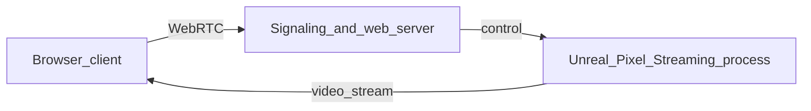

# Web Delivery – Pixel Streaming (Unreal Engine 5)

UE5 does **not** target the browser as a native client the way older HTML5 packaging did. For **playing in a web browser**, the standard approach is **Pixel Streaming**: run the packaged game on a **GPU-capable server** and stream video to the browser while sending keyboard/mouse/touch input back.

## Architecture

- **Unreal** runs your **shipping** build with the **Pixel Streaming** plugin enabled.
- A **signaling server** (Node.js sample from Epic) pairs the browser with the Unreal instance.
- Users open an **HTML player page** served by your stack; no heavy assets download to the client.

## Packaging

1. Enable **Edit → Plugins → Pixel Streaming** (and restart).
2. **File → Package Project** for **Windows** or **Linux** (Linux is common on cloud GPU VMs).
3. Run the packaged executable with Pixel Streaming arguments (see Epic docs for your UE version), e.g. extra args like `-PixelStreamingIP=...` / `-PixelStreamingPort=...` as required by your setup.

## Cloud / Server

- Use a VM with a **discrete GPU** (e.g. cloud GPU instance) for multiple concurrent streams or high resolution.
- Open firewall rules for **WebRTC** ports used by the signaling server and Unreal.
- For production: **HTTPS**, authentication, and **session limits** in front of the signaling app.

## CI / Git

- Store **source** (`Source/`, `Config/`, `Content/`, `.uproject`) in Git; **never** commit `Binaries/`, `Intermediate/`, `Saved/`, `DerivedDataCache/`.
- Optional: add a pipeline job that runs **Unreal Automation** or **UAT BuildCookRun** on a build machine with Unreal installed.

## Alternatives

- **Strict client-side WebGL** in the browser: use a different stack (e.g. Three.js/Babylon) or a **WebAssembly** engine; that is a separate project from this Unreal C++ codebase.
- **Cloud gaming** partners (third-party hosts) can wrap Pixel Streaming–style hosting for you.

For authoritative, version-specific flags and the official signaling server, use **Epic’s Pixel Streaming documentation** for your exact **UE 5.x** minor version.
